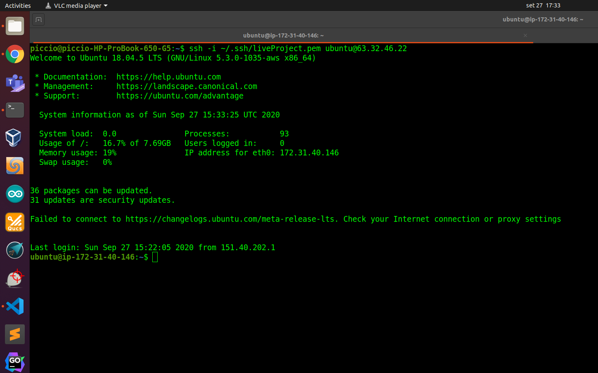

# Secure-Business-Infrastructure-with-your-own-VPN

## Link to my EC2 instance

This is the link to my Ubuntu 18 EC2 instance : [http://63.32.46.22/](http://63.32.46.22/)

I installed Apache2 web server on it and replaced the index page with a very simple one.

## Login Screenshot

## Link to S3 object

This is the lin to an image I uploaded on my S3 bucket : [https://myvpnliveproject.s3-eu-west-1.amazonaws.com/esempio.jpeg](https://myvpnliveproject.s3-eu-west-1.amazonaws.com/esempio.jpeg)